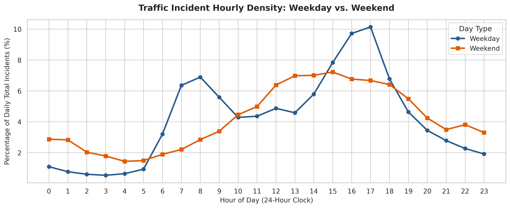
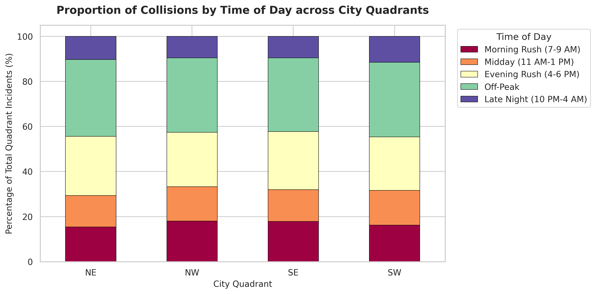
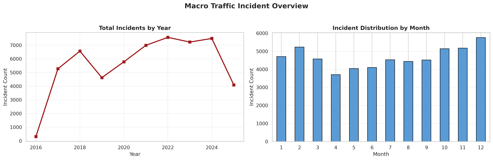
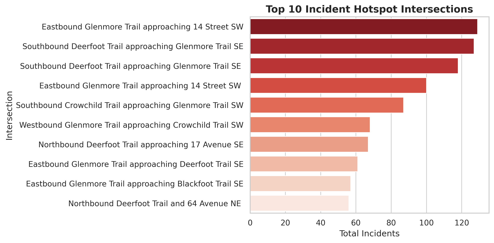

# 🚦 Calgary Traffic Incident Analysis & Risk Profiling

[](https://www.python.org/)
[](https://pandas.pydata.org/)
[](https://python-visualization.github.io/folium/)
[](https://seaborn.pydata.org/)

An exploratory data science project uncovering temporal, seasonal, and spatial collision patterns across **55,000+ traffic incidents** in Calgary, Alberta. 

This repository moves beyond surface-level statistics to evaluate **commute-hour risk dynamics, quadrant-level volatility, and high-density collision corridors** using custom feature engineering and interactive geospatial visual analytics.

---

## 📌 Key Insights & Strategic Findings

### 1. Temporal & Commute Risk Patterns
* **Sharply Bimodal Weekday Commutes:** Weekday incidents peak dramatically during the afternoon rush (**5:00 PM at ~10.2%** of total daily incidents) and morning rush (**8:00 AM at ~6.9%**). 
* **Weekend Risk Flattening:** Weekends show no morning spike; instead, incidents build gradually to a prolonged midday/afternoon risk plateau between **1:00 PM and 3:00 PM (~7.0%–7.2%)** and remain elevated late into the night compared to weekdays.
* **Weekly Incident Distribution:** Mid-week days (**Wednesday & Friday**) record the highest total crash volumes (~9,300+ incidents each), while **Sunday** experiences the lowest overall incident volume (~5,000 incidents).

### 2. Quadrant Disparities & High-Risk Corridors
* **Southeast (SE) Priority Zone:** The **SE quadrant** consistently records the highest incident volume across every month of the year, peaking at **1,501 incidents in December**.
* **Major Arterial Hotspots:** Collision concentrations heavily cluster along major high-speed arterial interchanges—specifically **Glenmore Trail, Deerfoot Trail, and Crowchild Trail**.
* **Top Collision Hotspot:** The intersection of **Eastbound Glenmore Trail approaching 14 Street SW** ranks as the #1 incident location (~129 incidents), closely followed by **Southbound Deerfoot Trail approaching Glenmore Trail SE** (~127 incidents).

### 3. Seasonal Volatility & Winter Anomalies
* **December Spike:** Across all quadrants and historical yearly trends, **December** experiences a major seasonal spike in crashes (e.g., reaching **961 incidents in Dec 2021** and **893 in Dec 2022**), driven by early-winter road condition shifts and holiday traffic density.
* **Historical Multi-Year Volatility:** Annual totals climbed steadily from ~5,200 in 2017 to peak levels of **~7,500 incidents in 2022**, illustrating sustained growth in city-wide traffic exposure over time.

## 📊 Sample Visualizations

| Hourly Commute Dynamics (Weekday vs. Weekend) | Quadrant Incident Distribution by Time of Day |
| :---: | :---: |
|  |  |

| Macro Analytics Dashboard | High-Risk Collision Hotspots |
| :---: | :---: |
|  |  |

---

##  Interactive Geospatial Map

The project generates a stand-alone **Folium HeatMap & Cluster Interactive Dashboard** (`outputs/calgary_traffic_density_map.html`). 

### Features:
* **Calibrated Spatial Density Heatmap:** Displays density gradients without oversaturating urban corridors.
* **Top 10 Hotspot Markers:** Explicit custom markers for high-crash intersections featuring interactive popups with **total incident counts** and **peak risk hours**.
* **Layer Controls & Custom Legend:** Toggle between density heatmap layers and specific intersection markers seamlessly.

> 💡 **Interactive Preview:** Clone the repository and open `outputs/calgary_traffic_density_map.html` in any web browser to interact with the map.

### Static Snapshot


---

## 📁 Repository Structure

```text
Calgary-Traffic-EDA/
├── data/
│   └── calgary_traffic.csv          # Raw traffic incident dataset
├── notebooks/
│   └── EDA.ipynb                    # Primary analysis notebook with full pipeline
├── outputs/
│   ├── calgary_traffic_density_map.html  # Interactive Folium map
│   ├── macro_analytics_dashboard.png     # Macro trends chart
│   ├── weekday_vs_weekend.png            # Commute-hour density analysis
│   ├── time_of_day_by_quadrant.png       # Quadrant x Time of Day proportions
│   ├── top_10_intersections.png          # Top hotspot rankings
│   └── heatmap_month_vs_year.png         # Monthly volatility heatmap
├── .gitignore
├── README.md
└── requirements.txt

```

---

## 🛠️ Tech Stack & Methods

* **Data Wrangling & Feature Engineering:** `pandas`, `numpy`
* Datetime parsing, temporal extraction (`hour`, `day_of_week`, `is_weekend`).
* Categorical mapping (`time_of_day`, `quadrant_clean`).
* Normalization techniques (converting raw counts into daily percentage proportions).


* **Data Visualization:** `matplotlib`, `seaborn`
* Multi-panel dashboards, proportion charts, pivot heatmaps.


* **Geospatial Analytics:** `folium`, `folium.plugins.HeatMap`
* Dynamic spatial density mapping and interactive HTML dashboard generation.


---

## ⚙️ How to Run Locally

### 1. Clone the Repository

```bash
git clone https://github.com/Prit05/Calgary-Traffic-EDA.git
cd Calgary-Traffic-EDA

```

### 2. Set Up Virtual Environment & Install Dependencies

```bash
python -m venv venv
source venv/bin/activate  # On Windows: venv\Scripts\activate
pip install -r requirements.txt

```

### 3. Run the Analysis

Open `notebooks/EDA.ipynb` in Jupyter Notebook or VS Code and run all cells. All generated charts and the interactive HTML map will automatically update in the `outputs/` folder.

---

## 📄 Data Source

Dataset obtained from the [City of Calgary Open Data Portal](https://data.calgary.ca/Transportation-Transit/Traffic-Incidents/35ra-9556/data_preview).

